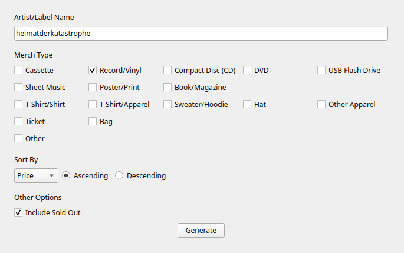

# Bandmerch
A simple GUI tool for searching for merchandise on Bandcamp!

<p align="center"></p>

## About
As of the writing of this readme, Bandcamp's merch pages lack search functions common to shopping platforms, such as filtering by product type or sorting by price.

Bandmerch bridges that gap by generating a new, filtered and sorted web page with all of the products you want to see. All you have to do is fill in the fields.

<p align="center"></p>

## Requirements
The app's only requirement is having a recent version of google chrome installed.

## Building
All you have to do is run `make`.\
You only need to have a recent version of python installed.\
The executable will be placed in the `dist` folder.

Note that this project is built using pyinstaller, which produces an executable for your current operating system. This means you need to build for Windows on Windows, Linux on Linux and so on.

## Running Directly
To run the script directly, without packaging, first create and enter a virtual environment:
```sh
make venv
source ./venv/bin/activate # or './venv/Scripts/activate' on Windows
```
Then, simply run `python src/main.py`.